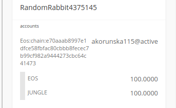
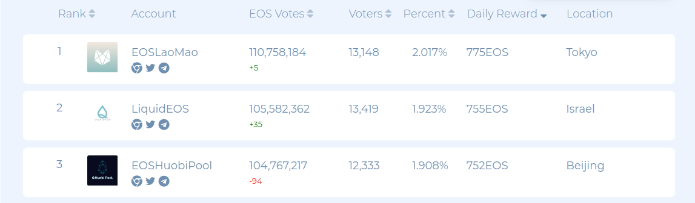
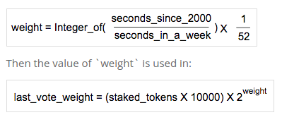

# PART 01: EOS Onboarding


### get EOS  chain_id
```
$ cleos get info
{
  "server_version": "ea08cfd3",
  "chain_id": "cf057bbfb72640471fd910bcb67639c22df9f92470936cddc1ade0e2f2e7dc4f",
  "head_block_num": 9714,
  "last_irreversible_block_num": 9713,
  "last_irreversible_block_id": "000025f1db4737019697e11b43ace86eeaa1d57431aae51faad4877b1b6531b2",
  "head_block_id": "000025f29f125cbfd221c1015edca6cdbe0e7ca09c9d13cbab61a45b8418e2b1",
  "head_block_time": "2019-03-16T17:38:49.000",
  "head_block_producer": "eosio",
  "virtual_block_cpu_limit": 200000000,
  "virtual_block_net_limit": 1048576000,
  "block_cpu_limit": 199900,
  "block_net_limit": 1048576,
  "server_version_string": "v1.5.0"
}


```

### generate pair of keys using eosjs
generate_keypair.js can be found in eos_onboarding/task_01
```
$ node generate_keypair.js 
5JNFM5TmWj1Lzn8Recg5NuCryEBtQnrEYed5Q2WK2qkUBL6dVnc
EOS763scBTBemUCCfkNKK4PmwV4c1R7ErkVzXscxMM4NkDFYBwHC3
```

### get all Block Producers (BPs) in the network

```
$ cleos system listproducers
```

### install scatter and cleos, create accounts in testnet (find a purse that supports testnet, find a way to create accounts in testnet, get yourself testEOS)

https://monitor.jungletestnet.io/



### find the top 21 (eos system table)
First 21 are top ones :)
```
$ cleos -u "http://jungle.eosmetal.io:18888" system listproducers
Producer      Producer key                                              Url                                                         Scaled votes
lioninjungle  EOS5g7gVXGeQVCTNW7U3gxeBJuvzvkmbCLioNqTUPYLjQXFGfQXfo     https://cryptolions.io                                      0,1588
alohaeostest  EOS7r5MsqVU5x9N95crSXbELK48MasNT1Daq9FQsW97wRJDM595wb     https://www.alohaeos.com/                                   0,0376
mosquitometa  EOS5YB3npnbWxVZqXUi7tVHLoPwjq67WRHaNELEkgqQyYrPALZjiq     https://eosmetal.io                                         0,0369
ohtigertiger  EOS7tigERwXDRuHsok212UDToxFS1joUhAxzvDUhRof8NjuvwtoHX     https://cryptolions.io                                      0,0367
eosphereiobp  EOS7TTJ2LsMPbCPsRJSxL2PhhHBqg8xNfV3MtBcx7gzYxH27YGSHh     https://eosphere.io                                         0,0365
junglesweden  EOS79e4HpvQ1y1HdzRSqE1gCKhdN9kFGjjUU2nKG7xjiVCakt5WSs     http://zverige.com/kingkong/                                0,0362
eosdacserval  EOS5CJJEKDms9UTS7XBv8rb33BENRpnpSGsQkAe6bCfpjHHCKQTgH     https://eosdac.io                                           0,0361
eos42panther  EOS8hPoDfJWxAHSkBkYH8fhkcjAz7a3yQ85W3L8RgwBw5aBt92vDQ     https://eos42.io/                                           0,0361
junglemorpho  EOS796kTMQF9sTjFz6cRftBXpxfH4aRSkSt9XSUV9hRxyxFkVgA2y     https://eoscostarica.io                                     0,0361
tokenika4tst  EOS6wkp1PpqQUgEA6UtgW21Zo3o1XcQeLXzcLLgKcPJhTz2aSF6fz     https://tokenika.io/                                        0,0361
eosbarcelona  EOS8N1MhQpFQR3YABzVp4woPBywQnS5BunJtHv8jxtNQGrGEiTBhD     https://eos.barcelona                                       0,0361
eosnationftw  EOS8YhQPU6agWNfXYswnyM5fLaLecoriyD1H5Ckr3R95Z38eWZ9qg     https://bp.eosnation.io                                     0,0361
eoscafeloons  EOS6XgXr6zGhyk6p2rSHrizUYCnhHCMjz3NuvBFGRATLUueBFC2tv     https://eoscafeblock.com                                    0,0361
atticlabjbpn  EOS5hVMcN6UVWtrNCxdp5HJwsz4USULmdfNA22UDyjRNdprXEiAP6     https://AtticLab.Net                                        0,0361
blockchained  EOS6VG88TsufLFhHYJscqXYQWFWgDCHUBYtvk6eXvpxEuYV9MUKGk     https://eos.blckchnd.com                                    0,0357
eosiodetroit  EOS5KoSVp3ktJ6BZ8G5gdAg19BwtUrmJDbAZ73KYip3uqrjnhSQby     http://eosdetroit.io                                        0,0357
jungleswedem  EOS79e4HpvQ1y1HdzRSqE1gCKhdN9kFGjjUU2nKG7xjiVCakt5WSs     http://zverige.com/kingkong/                                0,0356
ysignnodeacc  EOS7J7Wj23H7GPhR5kqy56GP3Nc6BZZPd1WXnVBARgyJ1h2HNzmPD     https://ysign.io                                            0,0350
gnuargentina  EOS84gipb2XWGZfVmm1jrYnTVNeS45Pq5pk3VN9Yk8wAyHGDKUJG2     https://eosargentina.io                                     0,0349
eosamsterdam  EOS65kKLaG5gqjHqqa6accj96Qsf2BcP4h9tqw423u9HbywpMhMBJ     https://eosamsterdam.net/                                   0,0325
batinthedark  EOS6dwoM8XGMQn49LokUcLiony7JDkbHrsFDvh5svLvPDkXtvM7oR     Free Place                                                  0,0111
clevermonkey  EOS5mp5wmRyL5RH2JUeEh3eoZxkJ2ZZJ9PVd1BcLioNuq4PRCZYxQ     Free Place                                                  0,0111
bigpolarbear  EOS6oZi9WjXUcLionUtSiKRa4iwCW5cT6oTzoWZdENXq1p2pq53Nv     Free Place                                                  0,0083
funnyhamster  EOS7A9BoRetjpKtE3sqA6HRykRJ955MjQ5XdRmCLionVte2uERL8h     Free Place                                                  0,0080
bighornsheep  EOS5xfwWr4UumKm4PqUGnyCrFWYo6j5cLioNGg5yf4GgcTp2WcYxf     Free Place                                                  0,0080
ssssssssnake  EOS8SDhZ5CLioNLie9mb7kDu1gHfDXLwTvYBSxR1ccYSJERvutLqG     Free Place                                                  0,0076
thesilentowl  EOS7y4hU89NJ658H1KmAdZ6A585bEVmSV8xBGJ3SbQM4Pt3pcLion     Free Place                                                  0,0076
wealthyhorse  EOS5i1HrfxfHLRJqbExgRodhrZwp4dcLioNn4xZWCyhoBK6DNZgZt     Free Place                                                  0,0076
soaringeagle  EOS6iuBqJKqSK82QYCGuM96gduQpQG8xJsPDU1CLionPMGn2bT4Yn     Free Place                                                  0,0076
thebluewhale  EOS6Wfo1wwTPzzBVT8fe3jpz8vxCnf77YscLionBnw39iGzFWokZm     Free Place                                                  0,0076
spideronaweb  EOS6M4CYEDt3JDKS6nsxMnUcdCLioNcbyEzeAwZsQmDcoJCgaNHT8     Free Place                                                  0,0076
littlerabbit  EOS65orCLioNFkVT5uDF7J63bNUk97oF8T83iWfuvbSKWYUUq9EWd     Free Place                                                  0,0075
jumpingfrogs  EOS7oVWG413cLioNG7RU5Kv7NrPZovAdRSP6GZEG4LFUDWkgwNXHW     Free Place                                                  0,0075
gorillapower  EOS8X5NCx1Xqa1xgQgBa9s6EK7M1SjGaDreAcLion4kDVLsjhQr9n     Free Place                                                  0,0075
hippopotamus  EOS7qDcxm8YtAZUA3t9kxNGuzpCLioNnzpTRigi5Dwsfnszckobwc     Free Place                                                  0,0075
hungryolddog  EOS6tw3AqqVUsCbchYRmxkPLqGct3vC63cEzKgVzLFcLionoY8YLQ     Free Place                                                  0,0075
iliketurtles  EOS6itYvNZwhqS7cLion3xp3rLJNJAvKKegxeS7guvbBxG1XX5uwz     Free Place                                                  0,0075
proudrooster  EOS5qBd3T6nmLRsuACLion346Ue8UkCwvsoS5f3EDC1jwbrEiBDMX     Free Place                                                  0,0075
pythoncolors  EOS8R7GB5CLionUEy8FgGksGAGtc2cbcQWgty3MTAgzJvGTmtqPLz     Free Place                                                  0,0075
chainr4decaf  EOS66kac59Fm7tUBcm2yYZ4DExYLgPjoSptHYQZdJHCKyH8pa2dsw     https://eos.chainrift.com/                                  0,0016
eosgermanybp  EOS6B55iZ71Q3vZn3Yvk7ksn47CoumThbQLzk1UzJL9aw2FB5jM4q     https://eosgermany.one                                      0,0012
testtestprod  EOS8h7oBcaQo8sN4fG5nRNeBuWp5UfbbBZumkvrqDUXvh4ivEk4kw                                                                 0,0011
blockgenesys  EOS88bSHqpR1WzmokyWrL2tPjChnJwhs1QndV8Banb4xbrojvZkaK     https://www.blockgenesys.com                                0,0010
southafricas  EOS7342DFPWVgaU78f1JwzTUw2pG2fbpvoM7D5XhTqP5XVgTqJ53Q     https://eosza.io                                            0,0005
evilproducer  EOS63Ho61PdCAf9dkzGmU9CJXi9seuUfYkjRKrV9WRz774eYZ71Ty     https://microsoft.com                                       0,0005
babylion1234  EOS6ZHd6Lpduw3pKmqBVGipxLeGN8QY8VJz8PRyLNdaCQTJpDnLxY     http://flowerprince.net                                     0,0003
memtripblock  EOS5BMFrhdz9G1efQQYJt2XbnrnLeUaFDuh15j2qYsQ3ioDGaB6js     https://memtrip.com/                                        0,0000
gcjungleprod  EOS748tvbyzrEoxHyF719fmftuc2qKahMxFM6hGFmF4UT6X98zgQC                                                                 0,0000
eoscityioeos  EOS7oa9SqnwFP6Rr4kFrpX1bKSKn4BunyTE2CwwtVhPNEyxRLpFZU     http://ck-nuc1.ddns.net                                     0,0000
dealination2  EOS5QRQmR6qZcr6RMLNLawb2qzEPmTEPdAr5wFXu9Z6q7Cxj3jP6U     http://node.dealin.io:8888                                  0,0000

```

### vote for a pair of BP

```
$ cleos -u "http://jungle.eosmetal.io:18888" get account akorunska115
created: 2019-03-17T10:39:19.500
permissions: 
     owner     1:    1 EOS5ervsyrpF7FNCKwacvdXgkTZXNEvyiFf7iFA2gwx7gKhQU1HN6
        active     1:    1 EOS6cga28XXFQRHdqehFfW8fnwjZw8kyHWU92ZaaD5YtSbBTGuZkp
memory: 
     quota:     5.344 KiB    used:     3.365 KiB  

net bandwidth: 
     staked:          1.0000 EOS           (total stake delegated from account to self)
     delegated:       0.0000 EOS           (total staked delegated to account from others)
     used:                 0 bytes
     available:        133.3 KiB  
     limit:            133.3 KiB  

cpu bandwidth:
     staked:          1.0000 EOS           (total stake delegated from account to self)
     delegated:       0.0000 EOS           (total staked delegated to account from others)
     used:                 0 us   
     available:        48.81 ms   
     limit:            48.81 ms   

EOS balances: 
     liquid:          100.0000 EOS
     staked:            2.0000 EOS
     unstaking:         0.0000 EOS
     total:           102.0000 EOS

producers:     <not voted>

$ cleos -u "http://jungle.eosmetal.io:18888" system voteproducer prods akorunska115 alohaeostest atticlabjbpn
executed transaction: 1f34fa52399bcd0d6cb369f1b18c5e2424f609fbbd38a6436efc42dba8bbeac2  128 bytes  411 us
#         eosio <= eosio::voteproducer          {"voter":"akorunska115","proxy":"","producers":["alohaeostest","atticlabjbpn"]}
warning: transaction executed locally, but may not be confirmed by the network yet         ] 

$ cleos -u "http://jungle.eosmetal.io:18888" get account akorunska115
created: 2019-03-17T10:39:19.500
permissions: 
     owner     1:    1 EOS5ervsyrpF7FNCKwacvdXgkTZXNEvyiFf7iFA2gwx7gKhQU1HN6
        active     1:    1 EOS6cga28XXFQRHdqehFfW8fnwjZw8kyHWU92ZaaD5YtSbBTGuZkp
memory: 
     quota:     5.344 KiB    used:     3.381 KiB  

net bandwidth: 
     staked:          1.0000 EOS           (total stake delegated from account to self)
     delegated:       0.0000 EOS           (total staked delegated to account from others)
     used:               129 bytes
     available:        133.2 KiB  
     limit:            133.3 KiB  

cpu bandwidth:
     staked:          1.0000 EOS           (total stake delegated from account to self)
     delegated:       0.0000 EOS           (total staked delegated to account from others)
     used:               347 us   
     available:        48.46 ms   
     limit:            48.81 ms   

EOS balances: 
     liquid:          100.0000 EOS
     staked:            2.0000 EOS
     unstaking:         0.0000 EOS
     total:           102.0000 EOS

producers:
     alohaeostest    atticlabjbpn 

```

### calculate how much EOS gets per day top 3 BP


45806.0874 EOS


### formula for calculating the vote decay for the account 



### create another permission for your own one

```
$ cleos set account permission bob aliceperm EOS7TZK89n3ZtTxyeXxhQLvnohS55Cik3Vf97QYorn2HThpgK8wzH -p bob@owner
executed transaction: eb5938ef570d9557255ac906eca84faeaabe4ca5841389fafb6b885c49fce8ef  160 bytes  2878 us
#         eosio <= eosio::updateauth            {"account":"bob","permission":"aliceperm","parent":"active","auth":{"threshold":1,"keys":[{"key":"EO...
warning: transaction executed locally, but may not be confirmed by the network yet         ] 

$ cleos get account bob
created: 2019-03-16T17:33:33.000
permissions: 
     owner     1:    1 EOS7TZK89n3ZtTxyeXxhQLvnohS55Cik3Vf97QYorn2HThpgK8wzH
        active     1:    1 EOS7TZK89n3ZtTxyeXxhQLvnohS55Cik3Vf97QYorn2HThpgK8wzH
           aliceperm     1:    1 EOS7TZK89n3ZtTxyeXxhQLvnohS55Cik3Vf97QYorn2HThpgK8wzH
memory: 
     quota:       unlimited  used:      2.99 KiB  

net bandwidth: 
     used:               unlimited
     available:          unlimited
     limit:              unlimited

cpu bandwidth:
     used:               unlimited
     available:          unlimited
     limit:              unlimited
```

### create Block Producer

```
$ cleos -u "http://jungle.eosmetal.io:18888" system regproducer akorunska115 EOS6cga28XXFQRHdqehFfW8fnwjZw8kyHWU92ZaaD5YtSbBTGuZkp http://produser.site 20 
   executed transaction: eba6b856e45dc7cdbe6ed097dffbad4f28ad39deddb4d2eca6fb77292fb22309  160 bytes  314 us
   #         eosio <= eosio::regproducer           {"producer":"akorunska115","producer_key":"EOS6cga28XXFQRHdqehFfW8fnwjZw8kyHWU92ZaaD5YtSbBTGuZkp","u...
   warning: transaction executed locally, but may not be confirmed by the network yet         ] 
```


### API to find the action (get_action) in which the transaction with the voice that you made in the task above

```
$ curl --request POST --url https://junglehistory.cryptolions.io:443/v1/history/get_transaction --header 'Cache-Control: no-cache' --header 'Content-Type: application/json' --data '{"id": "eba6b856e45dc7cdbe6ed097dffbad4f28ad39deddb4d2eca6fb77292fb22309"}'
```

### find the top 10 largest proxies, find the weight of the voice in the top 10 proxies and the weight of the voice in all accounts that vote through a proxy

https://www.alohaeos.com/vote/proxy?sort=rank&sortDir=asc#reg
```
madeofstarks
infstonespxy
investingwad
brockpierce1
lukeeosproxy
colintcrypto
chintaiproxy
cannonproxy1
eostitanvote
starteos.io
```
weight of voice in top-10 proxies: 82367249923207.4

in all proxies: 353227445601581
